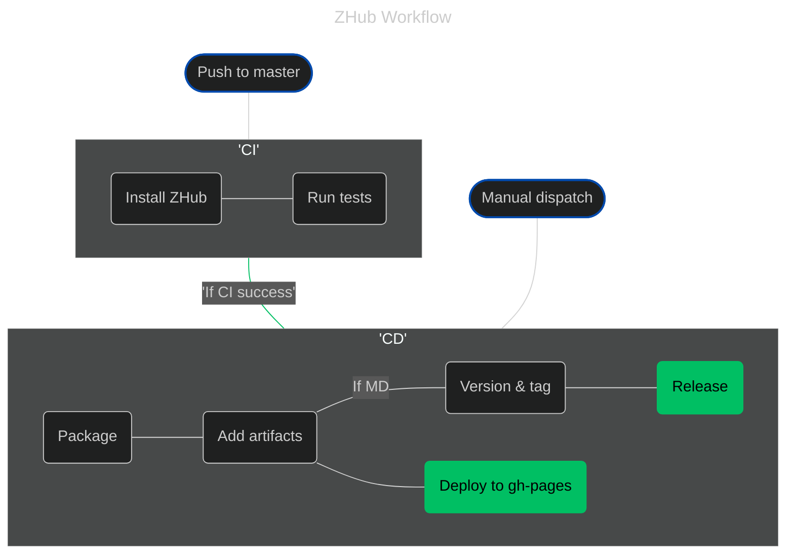

<p align="center"></p>
<p align="center">
    
    
    
</p>
<h1 align="center">ZHub</h1>
<p align="center">A nice place for all my applications to live and be tested.</p>

# Requirements

# Installation
You can Find all the latest releases and builds on the ZHub [release & build](https://jadenzaleski.github.io/zhub/) page.


## Latest Release
To download the latest release of ZHub, you can use the following command:
```bash
mkdir -p zhub && curl -L https://jadenzaleski.github.io/zhub/downloads/latest/release | tar -xzv -C zhub
```

## Latest Passing Build
To download the latest passing build of ZHub, you can use the following command:
```bash
mkdir -p zhub && curl -L https://jadenzaleski.github.io/zhub/downloads/latest/build | tar -xzv -C zhub
```

## Install
Once Zhub has been downloaded and extracted, you can install it using the following command: 
```bash
./bin/install.sh
```
# Upgrade


# Workflow
