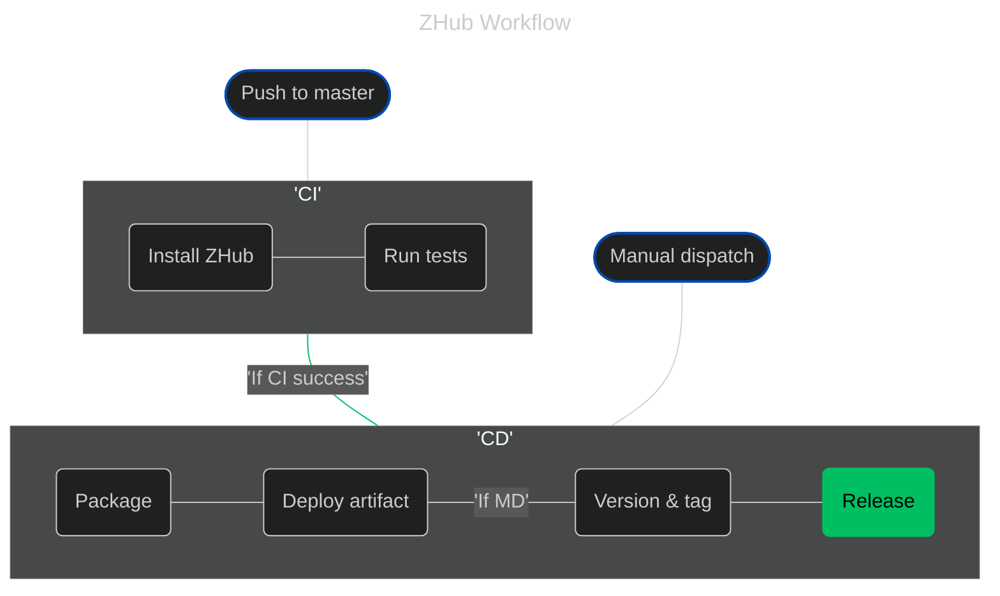

A nice place for all my applications to live and be tested.


# Installation

## Latest commit
To download the latest from the master branch:
```bash
curl -L -o zhub.zip https://github.com/jadenzaleski/zhub/archive/refs/heads/master.zip && unzip zhub.zip && mkdir zhub && cp -r zhub-master/* zhub && rm -rf zhub-master zhub.zip
```
This will download the latest version of zhub and extract it to a folder named `zhub`.

## Latest Release
...

## Latest Passing Build

# Workflow
All done with github actions.
CI runs on every push to master.
If CI passes, CD takes that and packages it up.
Will have one more workflow that will be dispatched manually to create an official release.

